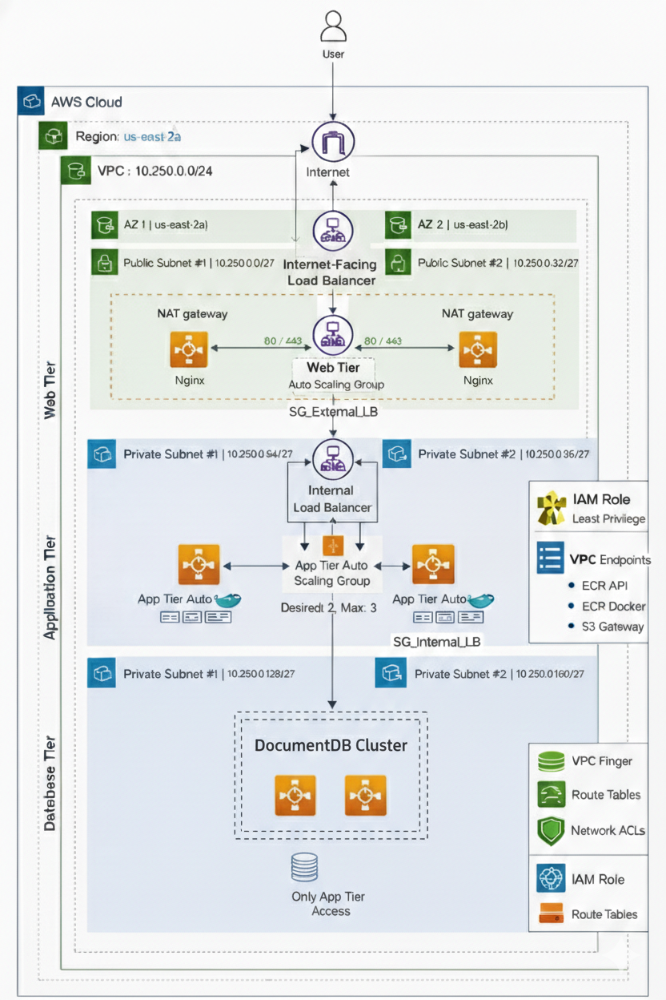

# 3-Tier AWS Architecture – Secure & Scalable VPC Design

This repository documents the design and implementation of a **production-grade 3-tier application architecture on AWS** using a custom VPC, following AWS best practices.

---

## Architecture Overview

The application is deployed using a classic **3-tier architecture**:

- **Web Tier** – Public-facing frontend
- **Application Tier** – Backend services (private)
- **Database Tier** – Managed database (private)

All tiers are isolated using **custom subnets, route tables, and security groups**, and deployed across **multiple Availability Zones** for high availability.

---

## Architecture Diagram

---

## Network Design

### VPC
- CIDR: `10.250.0.0/24`
- Region: `us-east-2`

### Subnets
| Tier | CIDR | AZ |
|---|---|---|
| Public-Web-AZ1 | 10.250.0.0/27 | us-east-2a |
| Public-Web-AZ2 | 10.250.0.32/27 | us-east-2b |
| Private-App-AZ1 | 10.250.0.64/27 | us-east-2a |
| Private-App-AZ2 | 10.250.0.96/27 | us-east-2b |
| Private-DB-AZ1 | 10.250.0.128/27 | us-east-2a |
| Private-DB-AZ2 | 10.250.0.160/27 | us-east-2b |

---

## Security Design

- Internet traffic allowed **only** to External Load Balancer
- Web Tier communicates with App Tier via **Internal Load Balancer**
- Database accessible **only from App Tier**
- No inbound internet access to private subnets

---

## AWS Services Used

- Amazon VPC
- Application Load Balancers
- Auto Scaling Groups
- Amazon EC2 & AMIs
- Amazon ECR & VPC Endpoints
- Amazon DocumentDB
- IAM & Security Groups

---

## Deployment Flow

1. Internet → External ALB
2. External ALB → Web Tier
3. Web Tier → Internal ALB
4. Internal ALB → App Tier
5. App Tier → DocumentDB

---

## Known Limitations

- Frontend image loading issue due to proxy configuration (non-blocking)
- HTTPS and WAF not yet enabled

---

## Future Improvements

- Enable HTTPS using AWS ACM
- Add AWS WAF
- Implement CloudWatch alarms and logging

---

## Author
**Snehith Armoor**  
